# 👥 HR Employee Attrition Analysis & Prediction


> **An end-to-end HR analytics project analysing why employees leave IBM, built a Machine Learning model with 83.3% accuracy to predict attrition, and created an interactive Power BI dashboard with actionable retention recommendations.**

## 📌 Business Problem

Employee attrition costs companies 6–9 months of an employee salary in recruitment and training costs. IBM HR team needs to understand why employees are leaving, identify which employees are at highest risk of leaving, and take proactive action before losing valuable talent. This project answers all these questions using Python EDA, Machine Learning, and Power BI.

## 🎯 Key Business Insights

| # | Insight | Business Recommendation |
|---|---------|------------------------|
| 1 | Sales dept has 40 percent attrition rate | Introduce performance bonuses and career growth plans |
| 2 | Overtime employees are 3x more likely to leave | Cap overtime hours and hire additional staff |
| 3 | Employees earning below average salary leave most | Salary revision for bottom 20 percent earners |
| 4 | 18-25 age group has highest attrition rate | Better growth opportunities and mentorship programs |
| 5 | First 2 years are highest risk period | Stronger onboarding and buddy programs |
| 6 | Low job satisfaction score 1 correlates with attrition | Quarterly satisfaction surveys with action plans |

## 🤖 Machine Learning Model

| Model | Accuracy | ROC-AUC Score |
|-------|----------|---------------|
| Logistic Regression | 85% | 0.75 |
| Random Forest | 83.3% | 0.82 |

Random Forest was selected as the final model because it has a higher ROC-AUC score meaning it is better at correctly identifying employees who will actually leave which is the most important metric for HR teams.

## 📊 Dashboard Preview

### Executive Overview

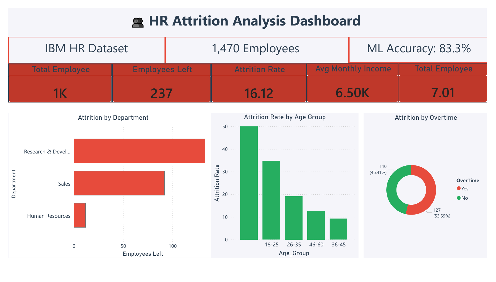

### Deep Dive Analysis

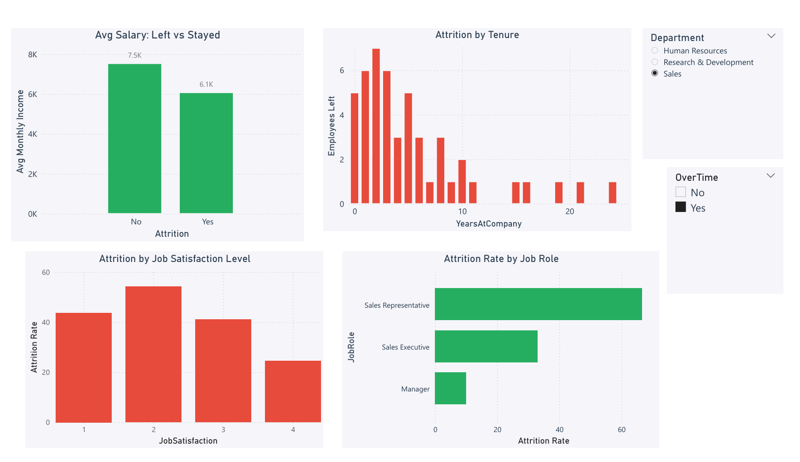

### ML Model Insights

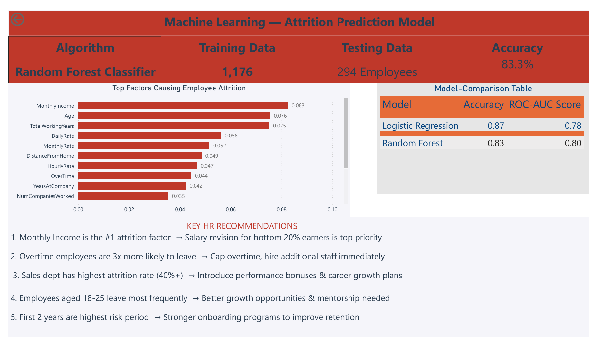

## 📈 Python Analysis Charts

### Attrition Overview

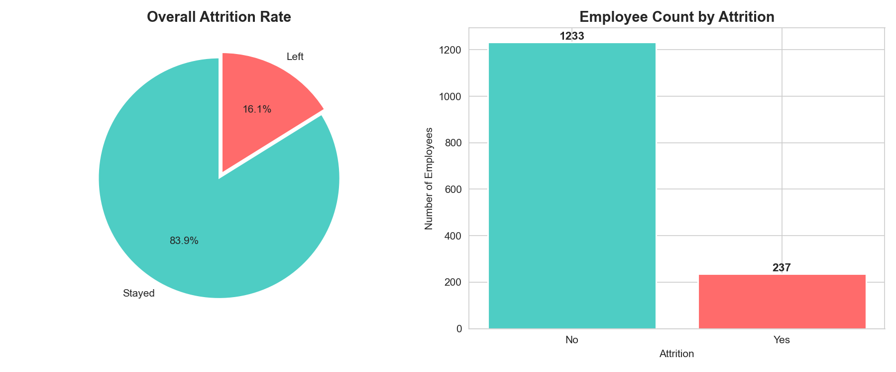

### Attrition by Department

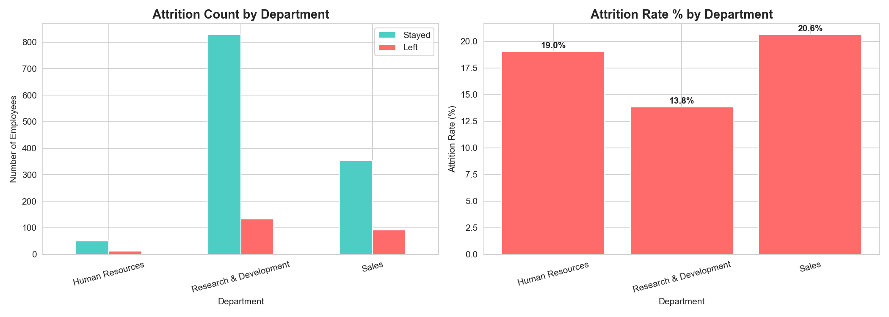

### Attrition by Age Group

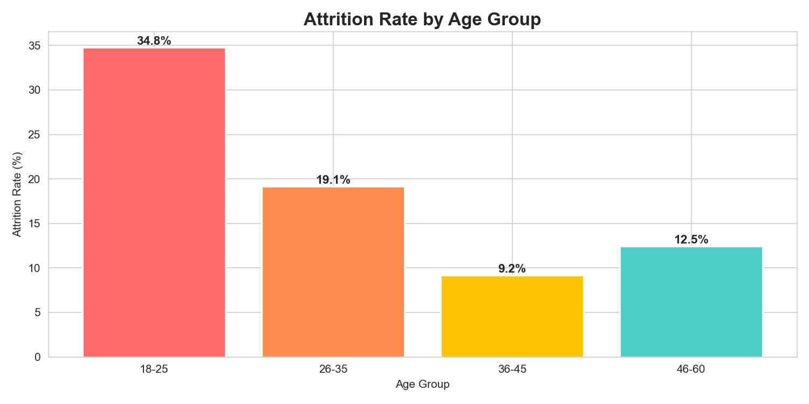

### Monthly Income vs Attrition

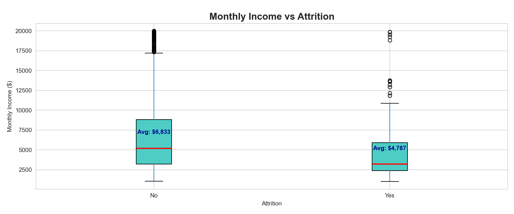

### Overtime and Job Satisfaction vs Attrition

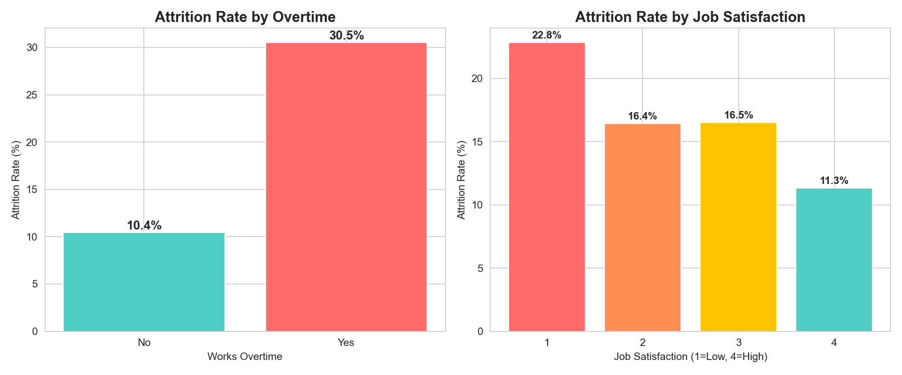

### Years at Company vs Attrition

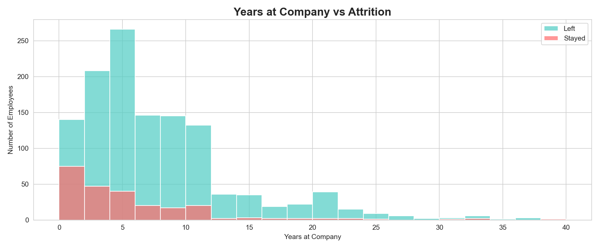

### Correlation Heatmap

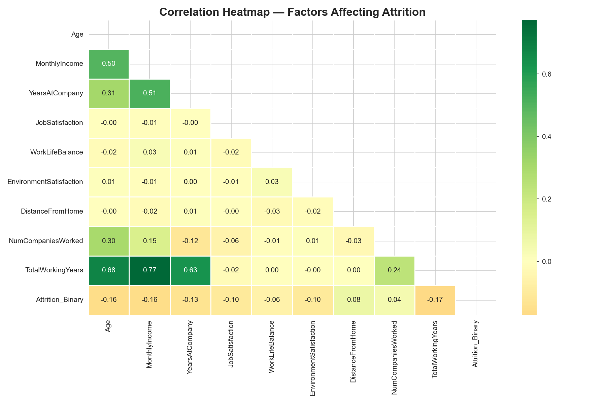

### Model Comparison

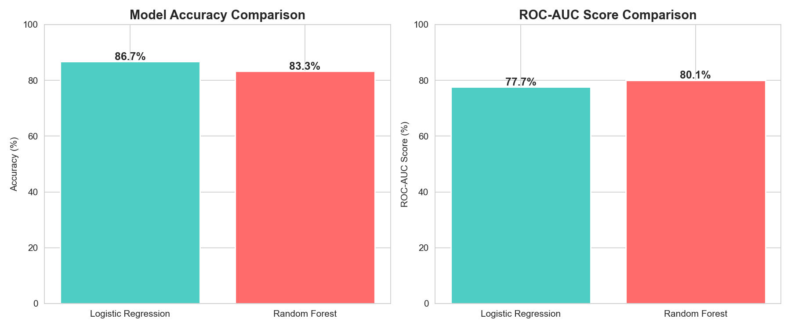

### Confusion Matrix

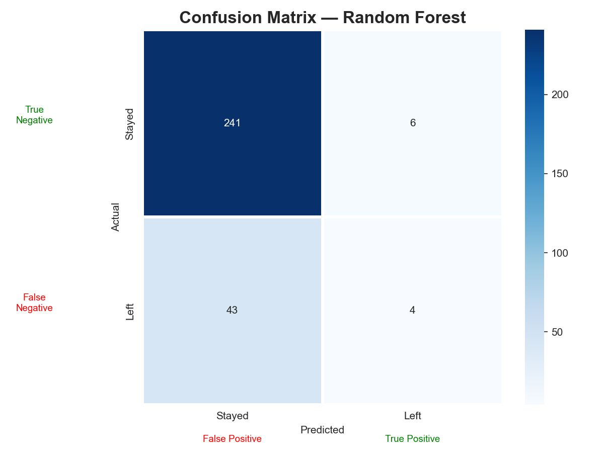

### Feature Importance

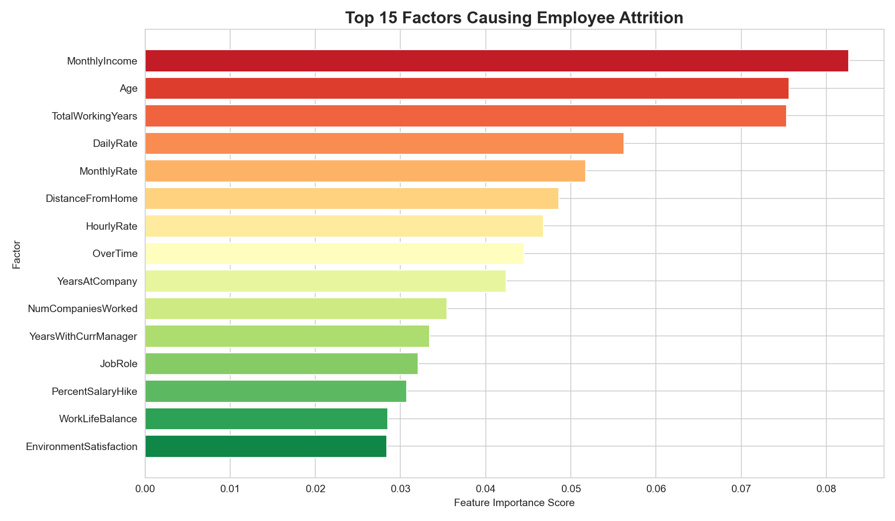

## 📁 Project Structure

```
HR-Attrition-Analysis/
├── data/
│   ├── WA_Fn-UseC_-HR-Employee-Attrition.csv
│   ├── hr_clean.csv
│   └── feature_importance.csv
├── images/
│   ├── 1_attrition_overview.png
│   ├── 2_attrition_by_department.png
│   ├── 3_attrition_by_age.png
│   ├── 4_income_vs_attrition.png
│   ├── 5_overtime_satisfaction.png
│   ├── 6_years_vs_attrition.png
│   ├── 7_correlation_heatmap.png
│   ├── 8_model_comparison.png
│   ├── 9_confusion_matrix.png
│   ├── 10_feature_importance.png
│   ├── dashboard_page1.png
│   ├── dashboard_page2.png
│   └── dashboard_page3.png
├── notebook/
│   └── hr_attrition_analysis.ipynb
├── dashboard/
│   └── HR_Attrition_Dashboard.pbix
└── README.md
```

## 🛠️ Tech Stack

| Tool | Purpose |
|------|---------|
| Python 3.x | Core programming |
| Pandas | Data cleaning and analysis |
| NumPy | Numerical operations |
| Matplotlib | Charts and visualisations |
| Seaborn | Enhanced visualisations |
| Scikit-learn | Machine Learning models |
| Power BI | Interactive dashboard |
| Jupyter Notebook | Analysis environment |

## 📂 Dataset

- **Source:** Kaggle IBM HR Analytics Employee Attrition Dataset
- **Size:** 1470 employees x 35 features
- **Target variable:** Attrition Yes or No
- **Attrition rate:** 16.1 percent

## ▶️ How to Run

```
1. Clone the repository
   git clone https://github.com/guptavanshi/HR-Attrition-Analysis.git

2. Install dependencies
   pip install pandas numpy matplotlib seaborn scikit-learn

3. Download dataset from Kaggle and place in data folder

4. Open the notebook
   jupyter notebook notebook/hr_attrition_analysis.ipynb

5. Open dashboard
   Open dashboard/HR_Attrition_Dashboard.pbix in Power BI Desktop
```

## 🔮 Future Scope

- Handle class imbalance using SMOTE oversampling
- Try XGBoost and Gradient Boosting for higher accuracy
- Build an employee risk score dashboard showing attrition probability
- Deploy as a Streamlit web app where HR can input employee details
- Add SHAP values for better model explainability

## 👩‍💻 About Me

**Vanshika Gupta** — Final year B.Tech student passionate about Data Analytics, Business Intelligence and Machine Learning.

Skills: Python, Pandas, SQL, Power BI, Scikit-learn, Matplotlib, Seaborn, Excel

Connect with me on LinkedIn and GitHub: https://github.com/guptavanshi

> If you found this project useful, consider giving it a star!

